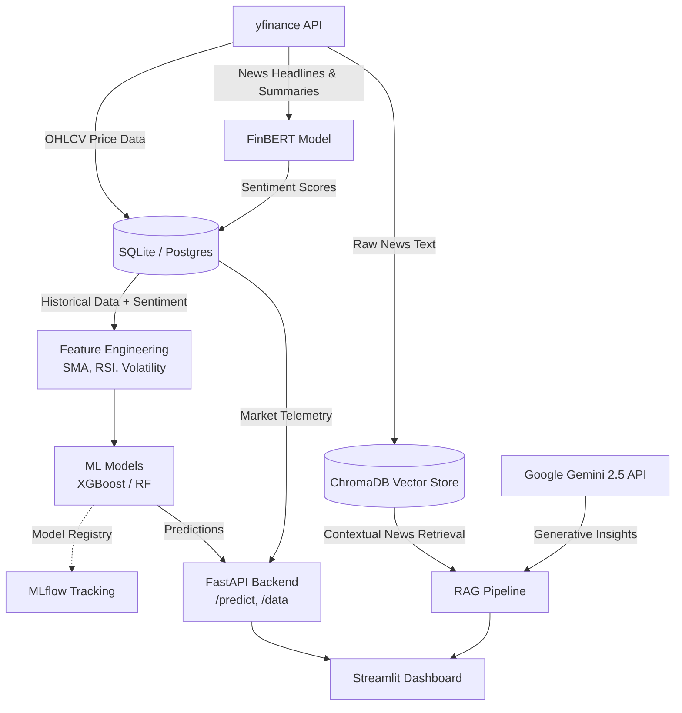

# ⚡ Financial Machine Learning Engineering (MLE) Pipeline

> **Video Demo**
> 
> *[Placeholder: Insert Video Demo URL Here]*
> 
> *Watch the pipeline in action, featuring automated ML training, live market telemetry, and generative RAG financial analysis.*

---

**End-to-End Financial ML & Generative AI Pipeline**. Features automated real-time OHLCV market data ingestion, HuggingFace FinBERT news sentiment scoring, ML market trend forecasting (XGBoost/RandomForest), and an interactive **ChromaDB + Google Gemini** RAG engine for deep-dive news Q&A. Fully deployed with FastAPI and Streamlit.

---

## 🏛️ System Architecture



---

## 🚀 Quick Start Guide

### 0. Prerequisites
You need a Google Gemini API Key for the RAG assistant to work.
Create a `.env` file in the root directory:
```env
GEMINI_API_KEY="your_api_key_here"
```

### 1. Local Setup (Without Docker)

```bash
# Activate virtual environment
python -m venv venv
# On Windows:
venv\Scripts\activate
# On Mac/Linux:
source venv/bin/activate

# Install dependencies
pip install -r requirements.txt

# 1. Run Data Ingestion Pipeline (Fetches OHLCV & News Sentiment)
python -m data_pipeline.run_pipeline --tickers AAPL MSFT NVDA SPY BTC-USD --period 2y

# 2. Train Model & Track with MLflow
python -m models.train --ticker AAPL --model_type rf

# 3. Launch FastAPI REST Server
uvicorn api.main:app --reload --port 8000

# 4. Launch Streamlit Web Dashboard (In another terminal)
streamlit run app/main.py
```

Open `http://localhost:8501` to access the interactive dashboard, and `http://localhost:8000/docs` to view interactive OpenAPI docs.

---

## ☁️ Cloud Fallback Mode (Streamlit Community Cloud)

If the FastAPI backend is not running (e.g., when deployed standalone on Streamlit Community Cloud), the Streamlit app seamlessly falls back to a serverless mode:
- Live data fetching is executed directly within Streamlit.
- The **RAG Engine** bypasses local ChromaDB caching and builds context directly from real-time `yfinance` fetches straight into **Google Gemini**, ensuring live financial Q&A works flawlessly without a persistent disk state.

---

## 🐳 Docker Deployment (Single Command)

```bash
docker-compose up --build
```

Spins up:
- **PostgreSQL Database**: Port `5432`
- **FastAPI Model Server**: `http://localhost:8000`
- **Streamlit Web UI**: `http://localhost:8501`

---

## 🧪 Running Tests

The test suite covers API endpoints, RAG pipeline integration, data fetching logic, and model training.

```bash
pytest tests/
```
